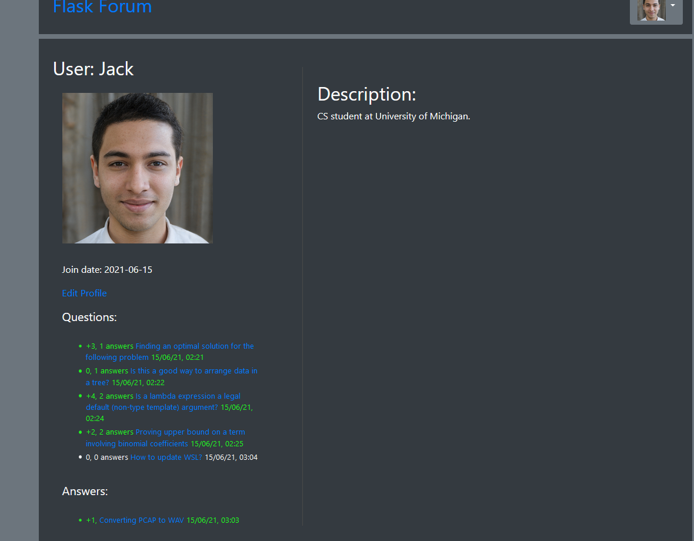
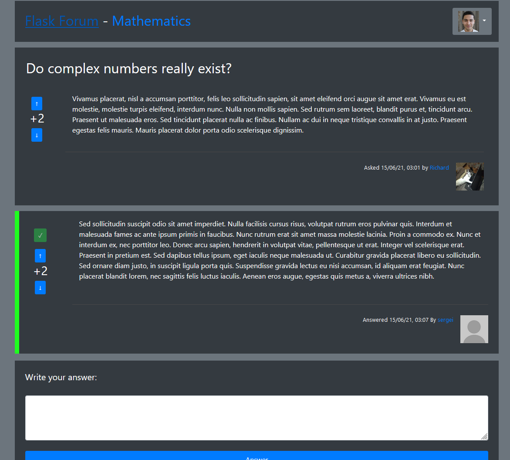
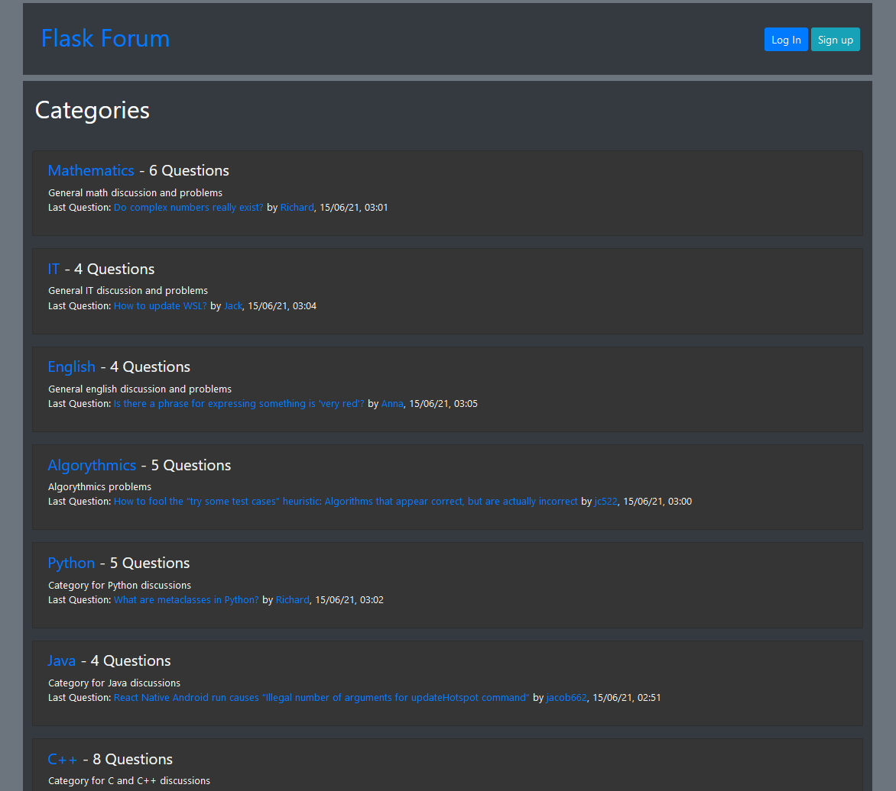

# Description
Simple [Python Flask](https://flask.palletsprojects.com/en/2.0.x/) forum project for Python subject on my university. 

It allows to create accounts, questions for specific categories, answers, voting for posts, choosing best answer and profile customization.

# How to get it running

 1. Install requirements:

    pip install -r requirements.txt

 2. Run main.py
 3. By default, forum is accessible from: http://127.0.0.1:5000/home/

# Views

 - home - basic start view, it contains list of categories and shows questions after choosing a category
 - log_in
 - sign_in
 - question - concrete question view, can be accessed from home view list. Questions can be voted (if one is logged in), logged users can add own answers. User that asks a question can choose the best one.
 - profile - view containing informations about some user such as asked questions and posted answers. User can have own picture and description.
 - edit_profile - edit profile form, fields are optional, user changes only things he want to change.
 - new_question

# Screenshots

#

#
 
